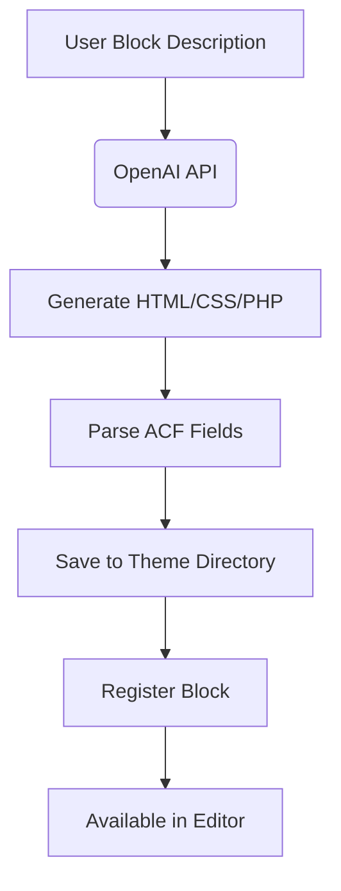

# AI Block Generator - WordPress Plugin


**Revolutionize your WordPress block development with AI-powered block generation!**

The AI Block Generator plugin leverages artificial intelligence to create custom Gutenberg blocks in seconds. Generate complete block templates with ACF field support, save them to your theme, and use them immediately in your WordPress site.

## 🚀 Features

- **AI-Powered Block Generation** - Create blocks with natural language prompts
- **Complete Block Templates** - Generates HTML, CSS, PHP and ACF field configurations
- **Theme Integration** - Saves blocks directly to your active theme directory
- **ACF Pro Integration** - Automatic Advanced Custom Fields support
- **Block Management** - Organize and manage all your AI-generated blocks
- **One-Click Registration** - Automatically registers blocks with WordPress
- **Live Preview** - See your blocks before implementing them
- **Customization** - Easily modify generated blocks to fit your needs

## 📦 Installation

1. Download the plugin ZIP file
2. Go to WordPress Admin → Plugins → Add New → Upload Plugin
3. Upload the ZIP file and activate the plugin
4. Get your API key from [Gemini AI]([https://aistudio.google.com/usage?project=vibrant-outpost-384111])
5. Go to AI Block Generator settings and enter your API key

## 🛠️ Requirements

- WordPress 5.8+
- PHP 7.4+
- Advanced Custom Fields PRO (recommended)
- OpenAI API key

## 🧩 Usage

### Generating a New Block
1. Go to WordPress Admin → AI Blocks → Generate New
2. Describe your block (e.g., "Hero section with title, subtitle, CTA button, and background image")
3. Click "Generate Block"
4. Review and customize the generated code
5. Save to your theme

### Managing Blocks
1. Go to WordPress Admin → AI Blocks → Manage Blocks
2. View all generated blocks
3. Edit, delete, or preview blocks
4. Toggle block activation

### Using Generated Blocks
1. Open any page/post in the WordPress editor
2. Add a new block
3. Find your AI-generated blocks in the "AI Blocks" category
4. Insert and customize as needed

## 🧠 How It Works



## ⚙️ Configuration

After activation, configure the plugin via:
**WordPress Admin → Settings → AI Block Generator**

- **OpenAI API Key**: Required for generating blocks
- **Default Block Directory**: Where blocks are saved (`/ai-blocks/` by default)
- **ACF Integration**: Enable/disable ACF field generation
- **Development Mode**: Enable debug notices

## 📂 File Structure

Generated blocks are saved with this structure:
```
your-theme/
└── ai-blocks/
    └── block-name/
        ├── block.php         # Block template
        ├── functions.php     # Block-specific functions
        ├── style.css         # Block-specific styles
        └── fields.json       # ACF field configuration
```

## 💻 Code Examples

### Registering Blocks
```php
// Sample block registration
acf_register_block_type(array(
    'name'              => 'ai-hero-section',
    'title'             => 'AI Hero Section',
    'render_template'   => get_template_directory() . '/ai-blocks/hero-section/block.php',
    'category'          => 'ai-blocks',
    'icon'              => 'cover-image',
    'keywords'          => array('hero', 'banner', 'header')
));
```

### Block Template (block.php)
```php
<?php
$fields = get_fields();
?>
<section class="ai-hero-section">
    <div class="hero-content">
        <h1><?php echo esc_html($fields['title']); ?></h1>
        <p><?php echo esc_html($fields['subtitle']); ?></p>
        <a href="<?php echo esc_url($fields['button_url']); ?>" 
           class="btn">
            <?php echo esc_html($fields['button_text']); ?>
        </a>
    </div>
    <?php if($fields['background_image']) : ?>
        " 
             alt="<?php echo esc_attr($fields['title']); ?>" 
             class="hero-bg">
    <?php endif; ?>
</section>
```

## ❓ FAQ

### Do I need coding skills to use this plugin?
No! The plugin generates complete blocks from natural language descriptions. Basic WordPress knowledge is sufficient.

### Is ACF Pro required?
While recommended for full functionality, basic HTML blocks work without ACF. Field-based blocks require ACF Pro.

### How much does it cost?
The plugin is free! You only need to provide your own OpenAI API key (usage costs apply based on OpenAI pricing).

### Can I modify generated blocks?
Absolutely! All generated code is fully customizable and stored in your theme directory.

### Does it work with any theme?
Yes, as long as your theme supports WordPress block editor (Gutenberg).

## 📜 Changelog

### 1.1.0 (Coming Soon)
- Block version management
- History of generation prompts
- Multi-block generation
- Export/import blocks

### 1.0.0
- Initial release with core functionality
- AI block generation from text prompts
- Block management interface
- ACF field integration
- Theme directory storage

## ⚖️ License

This plugin is licensed under the GPL-3.0+ license. See [LICENSE](LICENSE) for details.

## 👨‍💻 Contributing

Contributions are welcome! Please follow these steps:
1. Fork the repository
2. Create your feature branch (`git checkout -b feature/your-feature`)
3. Commit your changes (`git commit -am 'Add some feature'`)
4. Push to the branch (`git push origin feature/your-feature`)
5. Open a pull request

## 📧 Support

For support and feature requests, please:
- [Open an issue on GitHub](https://github.com/yourusername/ai-block-generator/issues)
- Visit the [WordPress support forum](https://wordpress.org/support/plugin/ai-block-generator)

---

**Transform your WordPress development workflow with AI-powered block generation!** 🚀
